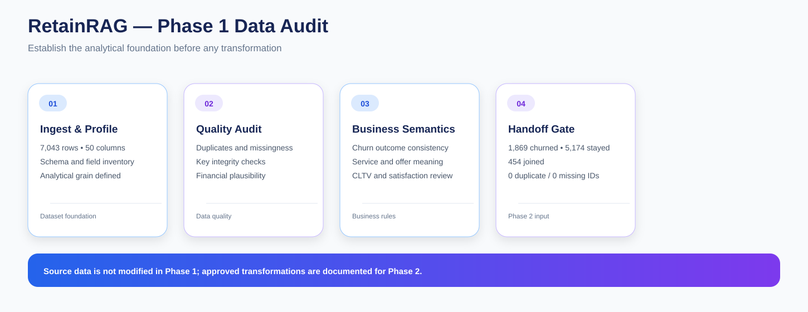

# RetainRAG — Phase 1: Data Ingestion & Data Quality Audit

Phase 1 establishes the analytical foundation for the RetainRAG telecom customer-retention project.

The purpose of this phase is not to clean or modify the source data. I first need to understand the dataset, verify its structural integrity, interpret the business meaning of important fields, and document which records and fields are safe to carry into downstream analysis.

---

## Objective

I use this phase to answer four questions before performing any transformation:

1. What does one row represent?
2. Are customer identifiers unique and complete?
3. Where are the data-quality issues?
4. Which fields need business interpretation before I use them analytically?

This gives me a documented baseline and a controlled handoff into Phase 2.

---

## Source Dataset

| Metric | Value |
|---|---:|
| Rows | 7,043 |
| Source columns | 50 |
| Churned customers | 1,869 |
| Stayed customers | 5,174 |
| Joined customers | 454 |
| Overall churn rate | 26.5% |
| Duplicate Customer IDs | 0 |
| Missing Customer IDs | 0 |
| Negative audited financial values | 0 |

The source file is treated as the baseline dataset for the entire project.

---

## Analytical Grain

I define the analytical grain as:

> One row = one telecom customer.

This matters because the downstream MySQL model, statistical analysis, segmentation and retention reporting all depend on maintaining a consistent customer-level grain.

I validate Customer ID before using it as the primary customer key.

---

## Notebook Sequence

### 01 — Dataset Overview

**01_dataset_overview.ipynb**

I use this notebook to establish the structure of the raw dataset.

Main work:

- load the source CSV
- inspect row and column counts
- profile column names and data types
- inspect numeric and categorical fields
- define the analytical grain
- validate the customer identifier
- create the initial schema inventory
- identify fields that require semantic interpretation

### 02 — Data Quality Audit

**02_data_quality_audit.ipynb**

I audit the source without modifying it.

Main checks:

- duplicate-row detection
- duplicate Customer ID detection
- missingness by column
- key integrity
- numeric plausibility
- financial integrity
- empty strings
- leading/trailing whitespace
- suspicious values and ranges

### 03 — Business Field Audit

**03_business_field_audit.ipynb**

I review fields where technical validity alone is not enough.

Areas covered:

- customer outcome consistency
- churn-detail applicability
- Offer semantics
- Internet Type semantics
- customer-service fields
- CLTV interpretation
- satisfaction interpretation
- churn-score interpretation
- eligibility of new customers for historical churn modeling
- business decision log

### 04 — Audit Summary

**04_audit_summary.ipynb**

I consolidate the findings into a formal handoff.

This notebook contains:

- executive snapshot
- churn distribution
- important quality findings
- documented data-quality decisions
- validation gates
- Phase 2 transformation handoff

---

## Data-Quality Controls

The audit separates different kinds of quality issues instead of treating every missing value as an error.

### Structural checks

I verify:

- expected dataset shape
- column inventory
- customer-level grain
- Customer ID uniqueness
- Customer ID completeness

### Missingness checks

I review missing values by field and classify them according to business meaning.

A missing value can represent:

- a genuine unavailable measurement
- a non-applicable field
- a field that should remain null
- a value that can be safely standardized later

### Financial checks

I review financial metrics for impossible negative values and other plausibility concerns before they are used in revenue or retention calculations.

### Text quality

I check for whitespace and empty-string problems that could create inconsistent categories later.

---

## Business Semantics

A major part of Phase 1 is understanding which fields describe outcomes and which describe customer state.

Churn-related fields require careful handling because:

- some fields apply only to churned customers
- joined customers are not historical churn outcomes
- supplied metrics such as churn score and CLTV can create leakage concerns during modeling

These decisions are documented here before downstream modeling begins.

---

## Phase Boundary

Phase 1 is deliberately non-destructive.

I do not overwrite or modify the source dataset in this phase.

The output of Phase 1 is a documented understanding of the source plus a set of approved transformation rules.

Those transformation rules are implemented only in:

**Phase 2 — Data Cleaning & Transformation**

---

## Handoff to Phase 2

~~~
Raw telecom dataset
        ↓
Phase 1 audit
        ↓
Quality + business decisions
        ↓
Approved transformation contract
        ↓
Phase 2 cleaning
~~~

---

## Key Outcome

Phase 1 gives RetainRAG a controlled analytical starting point.

The important result is not a cleaned file. It is the documented evidence needed to decide what can be trusted, what must be transformed, and what must remain untouched before the rest of the project is built.
