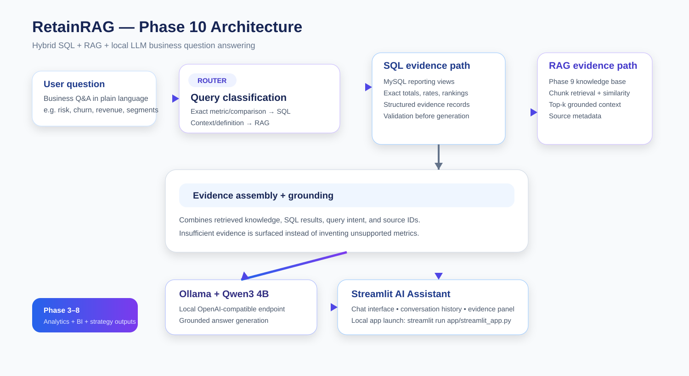
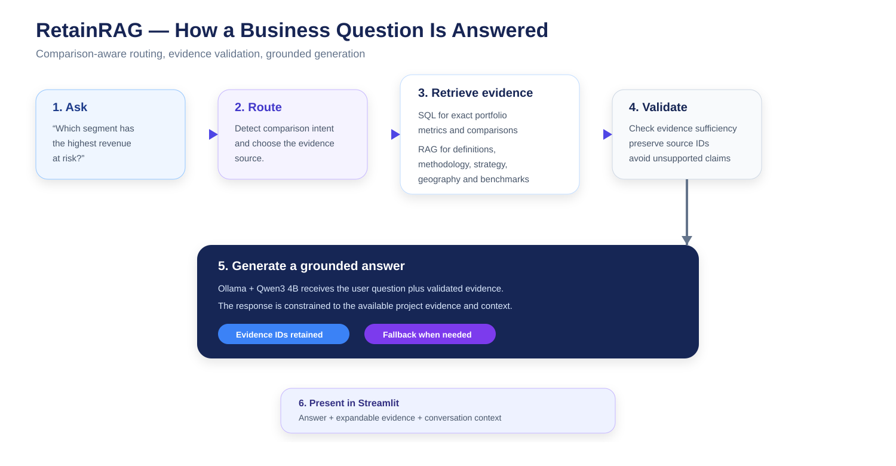

# RetainRAG — Phase 10: AI Assistant & Business Q&A

Phase 10 is the application layer that turns the RetainRAG analytics and RAG outputs into a reusable **AI business assistant**.

The system accepts a business question in natural language, determines what kind of evidence is needed, retrieves supporting information from the Phase 9 knowledge layer and/or MySQL, validates the available evidence, and then uses a local **Ollama + Qwen3 4B** model to generate a grounded response.

This phase is designed to answer questions about the retention analysis without treating the LLM as the source of truth. **Structured metrics come from SQL, contextual knowledge comes from retrieval, and the model is used for language generation over the evidence.**

---

## Phase 10 at a Glance

| Area | Implementation |
|---|---|
| User interface | Streamlit |
| Query engine | Python |
| Structured analytics | MySQL |
| Knowledge retrieval | Phase 9 RAG artifacts |
| Embeddings | SentenceTransformers when available |
| Retrieval fallback | TF-IDF artifacts from Phase 9 when configured |
| Local LLM | Ollama |
| Model | Qwen3 4B |
| Evidence | Source names, topics, similarity and evidence IDs |
| Conversation | Streamlit session history |
| Database | `retainiq` / `retainiq_user` |
| Default Ollama endpoint | `http://localhost:11434/v1` |

---

## Architecture

The assistant uses a hybrid architecture rather than routing every question through one retrieval method.



### The two evidence paths

**RAG retrieval**

RAG is used when the question needs project knowledge or explanatory context, such as:

- definitions and business terminology
- methodology and analytical interpretation
- retention strategy context
- geography and market context
- benchmarking context
- knowledge generated from the earlier RetainRAG phases

**SQL retrieval**

SQL is used when the question requires an exact structured value or a comparison that should be reproducible directly from the analytical database, such as:

- portfolio churn metrics
- segment-level revenue-at-risk comparisons
- market-level revenue-at-risk comparisons

The two sources can be combined before the response is generated.

---

## End-to-End Query Flow



The pipeline follows this sequence:

```text
User question
    ↓
Query classification / routing
    ↓
Semantic retrieval
    +
Optional SQL evidence
    ↓
Evidence assembly
    ↓
Evidence sufficiency / validation
    ↓
Ollama + Qwen3 4B
    ↓
Grounded answer + evidence
    ↓
Streamlit
```

The important design choice is that the LLM receives the **question plus retrieved/queried evidence**, rather than being asked to answer from unsupported model knowledge.

---

## What I Built

### 1. Reusable hybrid query engine

`app/query_engine.py` contains the core backend used by the application.

It handles:

- Phase 9 artifact discovery
- RAG asset loading
- embedding/vector loading
- query vectorization
- cosine-similarity retrieval
- comparison-aware retrieval
- MySQL connections
- supported SQL evidence routes
- grounded context construction
- local LLM calls
- final response packaging
- retrieval fallback when generation is unavailable

The backend is intentionally reusable so the Streamlit interface is only the presentation layer.

---

### 2. Phase 9 asset resolution

The backend does not depend on one fragile Unicode folder path.

It first checks:

1. `RETAINIQ_PHASE9_DIR` when explicitly provided
2. sibling directories beginning with `Phase 9`
3. nearby working-directory locations

A valid Phase 9 directory must contain:

```text
outputs/
├── retrieval_chunks.csv
├── retrieval_vectors.npy
└── retrieval_manifest.json
```

This makes the project easier to move between local Windows environments without hard-coding one exact directory name.

---

### 3. Semantic retrieval

The engine loads the Phase 9 retrieval artifacts and calculates cosine similarity between the user question and stored vectors.

For a normal question:

```text
Question
  → query vector
  → similarity against stored vectors
  → top-k evidence
```

The default retrieval configuration is:

| Parameter | Default |
|---|---:|
| `top_k` | 5 |
| `comparison_candidate_k` | 20 |
| `similarity_floor` | 0.10 |
| embedding model | `all-MiniLM-L6-v2` |

These values come from the Phase 9 configuration layer and can be overridden by environment variables for the LLM settings.

---

### 4. Comparison-aware retrieval

Comparison questions are more demanding than ordinary semantic lookup because retrieving several chunks from the same source can make a comparison incomplete.

The engine detects comparison language such as:

```text
highest
lowest
largest
smallest
top
bottom
compare
versus
vs
difference
more than
less than
```

For these questions it:

- expands the candidate pool
- ranks candidates by similarity
- diversifies across source documents
- keeps the strongest comparable evidence
- then reduces the final set to the configured `top_k`

This was introduced specifically to address the retrieval-completeness issue identified during Phase 9 evaluation.

---

### 5. Exact SQL evidence

When a question matches a supported exact-metric or comparison route, the engine queries MySQL directly.

Examples of currently supported routing include:

**Overall churn**

```sql
COUNT(*)
SUM(churned customers)
churn rate
```

**Segment revenue-at-risk comparison**

```sql
segment
customers
churned_customers
avg_cltv
revenue_at_risk
churn_rate_pct
```

**Market revenue-at-risk comparison**

```sql
state
city
customers
churned_customers
churn_rate_pct
avg_cltv
revenue_at_risk
```

For market comparisons, the current SQL route applies a minimum city-size filter of **25 customers**, matching the geographic comparison convention established earlier in the project.

---

## Grounded Context

Before the LLM is called, the system assembles the evidence into a structured context block.

Each evidence item carries metadata such as:

- evidence ID
- source name
- topic
- similarity score for RAG results
- structured SQL values for SQL evidence

Conceptually:

```text
Question
+
SQL evidence
+
Retrieved RAG evidence
+
Source metadata
=
Grounded context
```

The SQL evidence is placed first when available because it represents directly computed structured data from the analytical database.

---

## LLM Generation

The configured local model is:

```text
Ollama
└── Qwen3 4B
```

Default OpenAI-compatible endpoint:

```text
http://localhost:11434/v1
```

The model receives a system instruction that emphasizes:

- answer only from supplied evidence
- distinguish observations, calculations and assumptions
- do not invent missing values
- preserve evidence IDs
- only claim comparison results when the evidence supports the comparison
- do not present scenario assumptions as forecasts
- state clearly when evidence is insufficient

This creates a deliberately conservative answer-generation layer.

---

## Evidence-First Behavior

A key requirement of Phase 10 is that the assistant should **not manufacture a number simply because the model can produce one**.

The application can therefore return a response indicating that the available evidence is insufficient.

This is especially important for:

- incomplete comparison evidence
- unsupported metrics
- missing database access
- unavailable LLM generation
- weak retrieval results

When the LLM is unavailable, the backend can fall back to the retrieved evidence instead of pretending a generated answer was produced successfully.

---

## Streamlit Application

The user-facing application is implemented in:

```text
app/
├── query_engine.py
└── streamlit_app.py
```

The Streamlit interface provides:

- natural-language chat input
- multi-turn message history within the session
- assistant responses
- expandable **Evidence used** section
- evidence IDs and source metadata
- response mode visibility
- optional MySQL password entry for exact SQL-routed questions

Application launch:

```bash
streamlit run app/streamlit_app.py
```

### Application preview

The current Streamlit application provides a chat-first interface where the question, grounded response, and supporting evidence can be inspected together.


---

## Example Questions

Examples that fit the current routing and knowledge layer include:

```text
What is the overall churn rate?

Which segment has the highest revenue at risk?

Which markets have the highest revenue at risk?

What does Revenue at Risk mean?

What factors are associated with customer churn?

What does the retention strategy recommend for high-risk customers?
```

Exact numeric/comparison questions may require the MySQL password in the Streamlit sidebar. Knowledge and methodology questions can use the Phase 9 retrieval layer without requiring SQL credentials.

---

## Notebooks

Phase 10 is divided into four notebooks so each stage can be inspected and reproduced independently.

### 01 — Assistant Backend & Hybrid Query Router

`01_assistant_backend_and_hybrid_query_router.ipynb`

Focus:

- backend imports and configuration
- Phase 9 asset discovery
- retrieval pipeline
- SQL routing
- grounded context
- LLM integration
- end-to-end backend tests

### 02 — Comparison-Aware Retrieval & Evaluation

`02_comparison_aware_retrieval_and_evaluation.ipynb`

Focus:

- comparison query detection
- broader candidate retrieval
- source diversification
- comparison-oriented evaluation
- retrieval completeness checks

### 03 — Conversation History & Evidence Validation

`03_conversation_history_and_evidence_validation.ipynb`

Focus:

- multi-turn context handling
- evidence validation
- response/source alignment
- query-log preparation
- assistant behavior checks

### 04 — Streamlit App Integration & Testing

`04_streamlit_app_integration_and_testing.ipynb`

Focus:

- dependency checks
- application integration
- expected UI markers
- backend hooks
- end-to-end smoke testing
- local launch readiness

---

## Repository Structure

```text
Phase 10 — AI Assistant & Business Q&A/
│
├── app/
│   ├── query_engine.py
│   └── streamlit_app.py
│
├── config/
│   └── ...
│
├── docs/
│   ├── phase10-architecture.svg
│   └── phase10-query-flow.svg
│
├── notebooks/
│   ├── 01_assistant_backend_and_hybrid_query_router.ipynb
│   ├── 02_comparison_aware_retrieval_and_evaluation.ipynb
│   ├── 03_conversation_history_and_evidence_validation.ipynb
│   └── 04_streamlit_app_integration_and_testing.ipynb
│
├── outputs/
│   └── ...
│
├── requirements.txt
├── .gitignore
└── README.md
```

---

## Setup

### 1. Install Python dependencies

```bash
pip install -r requirements.txt
```

The Phase 10 requirements include:

```text
pandas
numpy
requests
mysql-connector-python
sentence-transformers
scikit-learn
joblib
jupyter
streamlit
```

### 2. Prepare Phase 9

Complete Phase 9 first and make sure these assets are available:

```text
retrieval_chunks.csv
retrieval_vectors.npy
retrieval_manifest.json
```

### 3. Start Ollama

Verify the local model:

```bash
ollama list
```

Make sure `qwen3:4b` is available and Ollama is running on the configured local endpoint.

### 4. Prepare MySQL

The SQL layer expects the RetainRAG MySQL environment used throughout the project:

```text
Host: localhost
Port: 3306
Database: retainiq
User: retainiq_user
```

The application can receive the password through the Streamlit sidebar or environment variables. Credentials should not be committed to the repository.

### 5. Run the notebooks

Run the four notebooks in this order:

```text
01 → 02 → 03 → 04
```

### 6. Launch the assistant

```bash
streamlit run app/streamlit_app.py
```

---

## Configuration

Phase 10 reuses the Phase 9 configuration file:

```text
Phase 9*/config/rag_parameters.csv
```

Important settings include:

```text
chunk_size
chunk_overlap
top_k
similarity_floor
comparison_candidate_k
embedding_model
llm_enabled
llm_base_url
llm_model
```

For the current local setup:

```text
llm_enabled = true
llm_base_url = http://localhost:11434/v1
llm_model = qwen3:4b
```

The environment variable `RETAINIQ_PHASE9_DIR` can be used when the Phase 9 directory is stored in a non-standard location.

---

## Reproducibility and Data Flow

Phase 10 is not a standalone chatbot.

It depends on the outputs produced by the earlier project phases:

```text
Phases 1–2
Data understanding + cleaning
        ↓
Phases 3–4
MySQL + analytics + statistical/modeling outputs
        ↓
Phases 5–6
Segmentation + geography
        ↓
Phases 7–8
Strategy + benchmarks
        ↓
Phase 9
Knowledge corpus + retrieval vectors
        ↓
Phase 10
Hybrid query engine + local AI assistant
```

This keeps the AI layer connected to the same analytical foundation instead of creating a separate, disconnected chatbot dataset.

---

## Outputs and Evidence

Phase 10 primarily produces application responses, evaluation results and evidence structures rather than another large analytical dataset.

The final response object contains:

```text
question
answer
mode
retrieved
sql_evidence
context
```

This structure allows the application and notebooks to inspect:

- what was asked
- which route was used
- what evidence was retrieved
- which SQL evidence was available
- what context was passed to the model
- what answer was ultimately returned

---

## Validation

The Phase 10 testing layer checks that the application contains its expected components, including:

- assistant backend imports
- Phase 9 asset resolution
- retrieval execution
- SQL evidence hooks
- LLM integration hooks
- Streamlit chat input
- message history
- evidence display
- app integration markers

The application was also tested locally with the Streamlit interface and the Ollama/Qwen3 4B setup.

---

## Limitations

Phase 10 is intentionally conservative, but it is not a fully general natural-language-to-SQL system.

Current limitations include:

- SQL routing covers a defined set of exact metric/comparison patterns rather than arbitrary SQL generation.
- Some questions may rely entirely on RAG when no supported SQL route exists.
- Retrieval quality depends on the Phase 9 corpus, vectors and configured similarity threshold.
- Local LLM response quality depends on the configured Ollama model and available system resources.
- MySQL-dependent questions require valid local database access.
- The application can fall back to evidence when generation fails, but that fallback is not equivalent to a natural-language answer.
- Geographic and strategy outputs remain descriptive/analytical and should not be interpreted as causal estimates.

These limitations are part of the current project design rather than hidden behavior.

---

## Design Principles

### Evidence before generation

The model is a language-generation layer over project evidence, not the underlying analytical authority.

### Structured questions should stay structured

Exact metrics and comparisons are routed toward MySQL where reproducible SQL calculations are available.

### Contextual questions benefit from retrieval

Definitions, methodology and business context are supplied through the Phase 9 knowledge layer.

### Unsupported claims should be surfaced

When evidence is incomplete, the assistant should say so rather than inventing a value.

### Local-first development

The current implementation uses local **Ollama + Qwen3 4B**, allowing the complete assistant workflow to run without requiring a hosted LLM endpoint.

---

## Phase 10 Outcome

With Phase 10, RetainRAG moves from an analytics project into an interactive application layer:

```text
Raw customer data
      ↓
Analytics
      ↓
Retention intelligence
      ↓
Knowledge layer
      ↓
Hybrid retrieval + SQL
      ↓
Local LLM
      ↓
AI business assistant
```

The result is an end-to-end workflow where customer-retention analysis can be explored through natural-language business questions while keeping the underlying evidence visible.

---

## Relationship to Earlier Phases

| Earlier phase | Contribution to Phase 10 |
|---|---|
| Phase 1 | Data/business understanding |
| Phase 2 | Clean analytical dataset |
| Phase 3 | MySQL warehouse and reporting layer |
| Phase 4 | Churn analysis and statistical/modeling outputs |
| Phase 5 | Customer segmentation and retention profiles |
| Phase 6 | Geospatial and market-level intelligence |
| Phase 7 | Retention strategy and Revenue at Risk |
| Phase 8 | Benchmarking and performance context |
| Phase 9 | Knowledge corpus, chunking, embeddings and retrieval |
| **Phase 10** | **Interactive AI assistant and business Q&A layer** |

---

## Final Application

Launch from this folder:

```bash
streamlit run app/streamlit_app.py
```

Phase 10 completes the RetainRAG workflow by connecting the project's analytical evidence, retrieval system, database layer and local LLM into a single business-facing interface.
