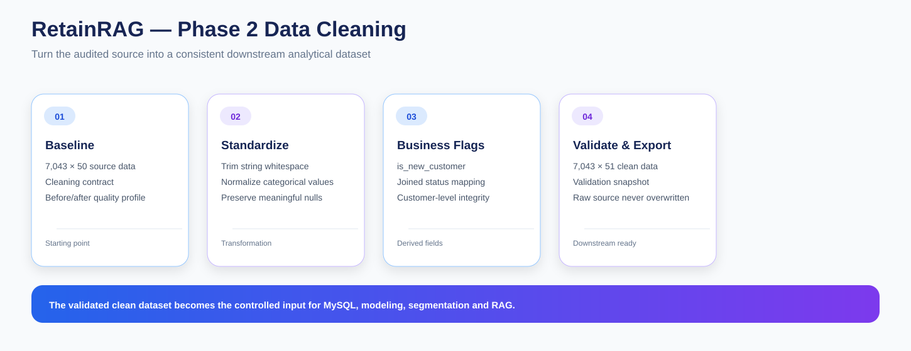

# RetainRAG — Phase 2: Data Cleaning & Transformation

Phase 2 converts the audited raw telecom dataset into a consistent downstream analytical dataset.

I use the data-quality decisions from Phase 1 to apply only the approved transformations. The raw source remains preserved, while the cleaned dataset becomes the controlled input for MySQL modeling, statistical analysis, segmentation, geospatial analysis, strategy, benchmarking and RAG.

---

## Objective

The goal of this phase is to produce a clean customer-level dataset with:

- consistent text formatting
- standardized categorical semantics
- explicit customer-state flags
- validated structure
- reproducible transformations
- an untouched copy of the raw source

---

## Before and After

| Dataset | Shape |
|---|---|
| Raw dataset | 7,043 rows × 50 columns |
| Clean dataset | 7,043 rows × 51 columns |

The row count remains unchanged because Phase 2 is focused on cleaning and standardization rather than deduplicating or filtering customers.

The additional column is the derived **is_new_customer** flag.

---

## Notebook Sequence

### 01 — Cleaning Scope & Baseline

**01_cleaning_scope_and_baseline.ipynb**

I establish:

- raw dataset baseline
- schema profile
- missing-value baseline
- transformation contract
- validation expectations

### 02 — Text & Categorical Standardization

**02_text_and_categorical_standardization.ipynb**

I standardize text and categorical values while preserving business meaning.

Main transformations:

- strip leading/trailing whitespace
- standardize null representations where approved
- fill Offer nulls with No Offer
- fill Internet Type nulls with No Internet Service
- preserve churn-detail nulls where they are semantically meaningful

### 03 — Customer Flags & Integrity

**03_customer_flags_and_integrity.ipynb**

I derive customer-level flags and run integrity checks.

The primary derived field is:

~~~
is_new_customer = Customer Status == "Joined"
~~~

I also validate that the cleaning process has not changed customer identity or row-level structure.

### 04 — Cleaning Validation & Export

**04_cleaning_validation_and_export.ipynb**

I run the final validation gate and export the approved clean dataset.

Main outputs include:

- clean schema profile
- post-cleaning missingness
- transformation log
- validation snapshot

---

## Approved Transformations

| Field / Area | Transformation |
|---|---|
| Offer | Null → No Offer |
| Internet Type | Null → No Internet Service |
| Churn Category | Preserve null |
| Churn Reason | Preserve null |
| String columns | Strip leading/trailing whitespace |
| Customer Status | Used to derive is_new_customer |

The rule is simple:

> Only approved transformations are applied.

---

## Why Some Nulls Are Preserved

Not every null is a data-quality defect.

For example, churn-detail fields can naturally be unavailable for customers who did not churn.

Therefore I preserve:

- Churn Category
- Churn Reason

rather than filling them with artificial categories that would change their meaning.

---

## Validation Strategy

I validate the clean dataset against the original baseline.

### Structural validation

- row count
- column count
- expected field presence
- customer-level grain
- Customer ID uniqueness

### Missingness validation

- remaining nulls
- expected null preservation
- newly introduced missing values

### Transformation validation

- standardized categories
- string cleanup
- derived customer flags
- transformation counts

### Integrity validation

- no accidental row loss
- no accidental duplication
- no unexpected changes to customer identifiers

---

## Outputs

### Data

~~~
data/
├── telco_raw.csv
└── telco_clean.csv
~~~

### Validation outputs

~~~
outputs/
├── 01_clean_schema_profile.csv
├── 02_missing_values_after_cleaning.csv
├── 03_transformation_log.csv
└── 04_validation_snapshot.csv
~~~

---

## Raw Data Protection

I never overwrite the source file.

The intended flow is:

~~~
telco_raw.csv
     ↓
approved transformations
     ↓
validation
     ↓
telco_clean.csv
~~~

This makes the cleaning stage reproducible and auditable.

---

## Downstream Role

~~~
Phase 1
Data audit
   ↓
Phase 2
Data cleaning
   ↓
Phase 3
MySQL analytical warehouse
   ↓
Phases 4–8
Analytics + strategy + benchmarking
   ↓
Phase 9
RAG knowledge layer
   ↓
Phase 10
AI business assistant
~~~

---

## Key Outcome

Phase 2 produces the first controlled analytical version of the telecom customer data.

The important outcome is not only that the values are cleaner, but that every transformation is explicit, reproducible and tied back to a documented data-quality decision.
