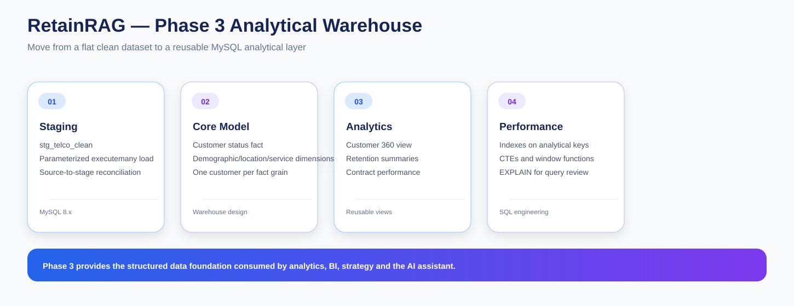

# RetainRAG — Phase 3: SQL Data Modeling & Analytical Warehouse Design

Phase 3 moves RetainRAG from a clean flat file into a reusable **MySQL 8.x analytical warehouse**.

I use the cleaned customer-level dataset from Phase 2 to build a structured SQL layer that can support exploratory analysis, retention reporting, segmentation, geospatial analysis, strategy, benchmarking and the hybrid SQL + RAG assistant in Phase 10.

---

## Objective

The main objectives are:

- create a reliable MySQL data foundation
- preserve one-customer-per-row analytical grain in the fact layer
- separate business dimensions from customer status
- build reusable reporting views
- add indexes for common analytical access paths
- validate relationships and record counts
- demonstrate production-style SQL patterns

---

## Technology

| Component | Choice |
|---|---|
| Database | MySQL 8.x |
| Python connector | mysql-connector-python |
| Load method | Parameterized executemany() |
| Source | Phase 2 telco_clean.csv |
| Analytical grain | One row per customer |

---

## Notebook Sequence

### 01 — MySQL Schema Design

**01_mysql_schema_design.ipynb**

I design the warehouse structure and document:

- tables
- keys
- relationships
- column types
- analytical grain
- staging strategy

### 02 — MySQL Database Build & Load

**02_mysql_database_build_and_load.ipynb**

I create the database objects and load the clean customer data using parameterized MySQL executemany().

The load path is:

~~~
telco_clean.csv
      ↓
stg_telco_clean
      ↓
fact + dimension tables
~~~

### 03 — MySQL Validation & Analytics

**03_mysql_validation_and_analytics.ipynb**

I validate:

- row counts
- customer-key uniqueness
- foreign-key integrity
- orphan records
- churn distributions
- reconciliation checks

### 04 — Advanced SQL Views & Performance

**04_mysql_advanced_sql_views_and_performance.ipynb**

I demonstrate:

- joins
- aggregation
- CASE
- CTEs
- window functions
- views
- indexes
- EXPLAIN
- reusable Customer 360 reporting

---

## SQL Structure

### Staging

- stg_telco_clean

### Fact table

- fact_customer_status

The fact table uses customer_id as the customer-level key and maintains the project’s one-row-per-customer grain.

### Dimension tables

- dim_demographics
- dim_location
- dim_services
- dim_account
- dim_churn_detail

Conceptually:

~~~
                  dim_demographics
                         |
dim_location → fact_customer_status ← dim_services
                         |
                  dim_account
                         |
                  dim_churn_detail
~~~

---

## Validation Targets

| Check | Target |
|---|---:|
| Customers | 7,043 |
| Churned | 1,869 |
| Stayed | 5,174 |
| Churn rate | 26.5% |
| Duplicate fact keys | 0 |
| Orphan dimension rows | 0 |

These checks are intended to prove that the SQL build has preserved the customer population and relationships from Phase 2.

---

## Reporting Views

### vw_customer_360

A consolidated customer-level analytical view for downstream analysis.

### vw_retention_summary

A retention-oriented summary layer for customer counts and churn metrics.

### vw_contract_performance

A contract-focused analytical view used to understand differences in retention behavior.

### vw_revenue_at_risk

A reporting layer for historical revenue exposure associated with churned customers.

These views reduce repeated SQL logic in later phases.

---

## Indexing and Performance

I add indexes around fields that appear frequently in analytical filtering and reporting, including:

- churn label
- CLTV
- satisfaction
- contract
- payment method
- internet type
- state
- city

I also use EXPLAIN to inspect query plans and connect SQL syntax with practical query-performance considerations.

---

## SQL Skills Demonstrated

The phase covers:

- DDL
- DML
- DQL
- primary and foreign keys
- joins
- grouping and aggregation
- conditional logic with CASE
- CTEs
- window functions
- views
- indexing
- query-plan inspection
- validation and reconciliation

---

## Python Integration

I connect to MySQL using mysql-connector-python.

The loading process uses parameterized statements and executemany() rather than pandas.to_sql().

Database credentials are not hard-coded into the notebooks or repository.

---

## Role in RetainRAG

~~~
Phase 2
Clean customer data
      ↓
Phase 3
MySQL warehouse
      ↓
Phase 4  → EDA + modeling
Phase 5  → segmentation
Phase 6  → geospatial analysis
Phase 7  → retention strategy
Phase 8  → benchmarking
Phase 9  → RAG corpus
Phase 10 → hybrid AI assistant
~~~

---

## Key Outcome

Phase 3 turns the cleaned CSV into a structured analytical environment.

The result is a MySQL layer that is:

- reusable
- queryable
- validated
- performance-aware
- ready for downstream analytics
- suitable for structured evidence retrieval in the final AI assistant
