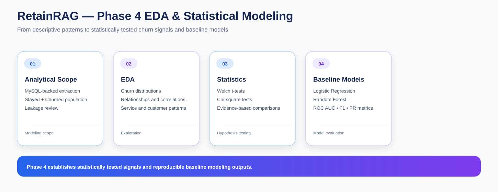

# RetainRAG — Phase 4: EDA & Statistical Modeling

Phase 4 uses the MySQL analytical layer to investigate customer churn, test relationships statistically, and establish baseline machine-learning models.

The focus is not only on visualization. I combine exploratory analysis, formal hypothesis tests, model evaluation and leakage checks so the project has a stronger analytical foundation before moving into segmentation and retention strategy.

---

## Objective

I use this phase to answer:

- What patterns are visible in historical churn?
- Which differences can be tested statistically?
- Which features provide useful baseline predictive signal?
- Which fields could create leakage?
- How should the historical modeling population be defined?

---

## Notebook Sequence

### 01 — Analytical Dataset & EDA

**01_analytical_dataset_and_eda.ipynb**

I pull analytical data directly from MySQL and examine:

- churn distribution
- customer and service characteristics
- numeric distributions
- categorical relationships
- correlations
- historical churn patterns

### 02 — Hypothesis Testing & Churn Drivers

**02_hypothesis_testing_and_churn_drivers.ipynb**

I formalize selected comparisons with:

- Welch's independent-samples t-tests
- chi-square tests of independence
- effect-oriented descriptive statistics
- churn-driver summaries

### 03 — Baseline Churn Modeling

**03_baseline_churn_modeling.ipynb**

I build baseline models using a leakage-aware historical population.

Models:

- Logistic Regression
- Random Forest

The train/test split is stratified, and class weighting is used where appropriate.

### 04 — Model Evaluation & Findings

**04_model_evaluation_and_findings.ipynb**

I evaluate:

- ROC AUC
- precision
- recall
- F1
- average precision
- confusion matrix
- ROC curve
- precision-recall curve
- feature importance
- coefficient interpretation
- cross-validation stability

---

## Modeling Population

For historical churn modeling I use:

- Stayed
- Churned

I keep Joined customers outside the training population because joined customers do not represent completed historical churn outcomes.

---

## Leakage Review

I exclude direct outcome fields such as:

- churn_label
- churn_category
- churn_reason

I also treat supplied fields such as churn_score and CLTV with caution because their definitions and timing can introduce target leakage depending on how they were generated.

The project documents these decisions rather than silently using every available variable.

---

## Statistical Methods

### Welch’s t-test

Used for comparing means between groups where equal-variance assumptions should not be imposed.

### Chi-square test

Used to evaluate associations between categorical variables and churn outcomes.

### Descriptive statistics

Used to summarize the size, central tendency and distribution of key measures.

### Correlation analysis

Used as an exploratory tool to understand relationships between numeric variables.

Statistical results are interpreted alongside sample sizes, distributions and business meaning rather than as standalone proof of causality.

---

## Modeling Approach

~~~
MySQL analytical data
        ↓
Historical population
        ↓
Leakage review
        ↓
Train / test split
        ↓
Logistic Regression + Random Forest
        ↓
Cross-validation
        ↓
Evaluation metrics
        ↓
Feature interpretation
~~~

---

## Evaluation Metrics

### ROC AUC

Measures ranking ability across classification thresholds.

### Precision

Shows the proportion of predicted churners that are actually churned in the evaluation set.

### Recall

Shows the proportion of actual churners captured by the model.

### F1

Balances precision and recall.

### Average Precision

Provides a precision-recall oriented summary, especially useful when the positive class is not dominant.

### Confusion Matrix

Shows counts of true positives, true negatives, false positives and false negatives.

---

## Model Validation

I use stratified 5-fold cross-validation to check whether observed model metrics are reasonably stable across folds.

This is not presented as a final production model. It is a baseline modeling stage intended to establish analytical signal and create interpretable risk outputs for later phases.

---

## Main Outputs

- customer_churn_risk_scores.csv
- model_comparison.csv
- random_forest_feature_importance.csv

These outputs can be used by downstream retention analysis and documentation.

---

## Interpretation Rules

The phase distinguishes:

- descriptive pattern
- statistical association
- predictive signal
- causal claim

A statistically significant relationship does not by itself prove causation.

Likewise, baseline model performance is not treated as a guarantee of future production performance.

---

## Role in RetainRAG

~~~
Phase 3
MySQL warehouse
      ↓
Phase 4
EDA + statistics + baseline ML
      ↓
Phase 5
Customer segmentation
      ↓
Phase 6
Geographic context
      ↓
Phase 7
Retention strategy
~~~

---

## Key Outcome

Phase 4 turns the SQL data foundation into tested analytical evidence.

The project now has:

- documented churn patterns
- hypothesis-test results
- baseline predictive models
- model evaluation metrics
- leakage considerations
- reusable customer-risk outputs

This becomes the analytical evidence layer for the later retention and AI components.
