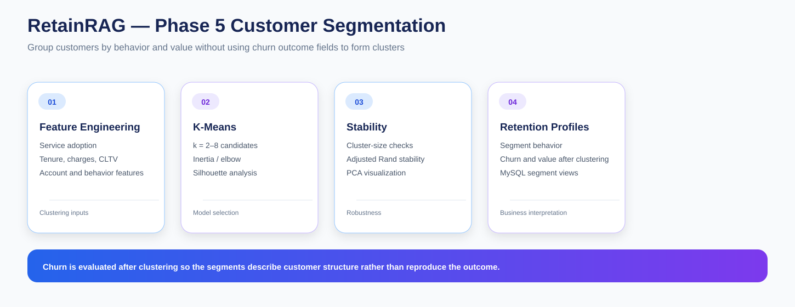

# RetainRAG — Phase 5: Customer Segmentation & Retention Profiling

Phase 5 adds a behavioral customer-segmentation layer to RetainRAG.

I use customer characteristics such as service adoption, tenure, charges, revenue, satisfaction and account behavior to create interpretable customer groups. Churn outcomes are deliberately excluded from the clustering inputs and are evaluated only after the segments are formed.

---

## Objective

I use segmentation to answer a different question from churn modeling.

Instead of asking only:

> Who is likely to churn?

I ask:

> What types of customers exist in the portfolio, and how does retention behavior differ across those groups?

---

## Notebook Sequence

### 01 — Segmentation Dataset & Feature Engineering

**01_segmentation_dataset_and_feature_engineering.ipynb**

I prepare the clustering dataset using customer characteristics from the analytical layer.

Feature categories include:

- service count
- referred-friend behavior
- paperless billing
- tenure
- monthly charge
- total revenue
- CLTV
- satisfaction
- data usage
- long-distance usage
- referrals
- dependents
- total charges
- contract
- internet type
- payment method
- offer

Categorical fields are encoded and numeric variables are standardized before clustering.

### 02 — Clustering & Segment Model Selection

**02_clustering_and_segment_model_selection.ipynb**

I evaluate K-Means candidates across:

~~~
k = 2 through 8
~~~

I compare:

- inertia / elbow behavior
- silhouette score
- cluster-size balance
- adjusted Rand stability across seeds

### 03 — Segment Profiling & Customer Behavior

**03_segment_profiling_and_customer_behavior.ipynb**

I profile the resulting clusters using:

- customer counts
- behavioral characteristics
- account patterns
- value metrics
- service adoption
- retention outcomes after clustering

### 04 — Retention Profiles & MySQL Publishing

**04_retention_profiles_and_mysql_publishing.ipynb**

I translate the cluster outputs into retention profiles and publish them into MySQL reporting objects.

---

## Important Segmentation Rule

I do not use churn outcome fields as clustering inputs.

The sequence is:

~~~
Customer characteristics
        ↓
Feature engineering
        ↓
K-Means clustering
        ↓
Cluster selection
        ↓
Segment profiles
        ↓
Add churn + value context
~~~

This reduces the risk that segmentation simply reproduces the churn label.

---

## Model Selection

A clustering solution is not chosen from one metric alone.

### Inertia

Helps understand how within-cluster dispersion changes as the number of clusters increases.

### Silhouette score

Provides a measure of how well observations fit their assigned cluster relative to neighboring clusters.

### Cluster-size balance

Helps avoid solutions where one cluster contains almost everyone and the remaining clusters are too small to support meaningful interpretation.

### Stability

Adjusted Rand Index comparisons across random seeds provide a basic check of segmentation stability.

### PCA

Used for visualization and projection of the high-dimensional feature space.

---

## Segment Retention Profiles

After clustering, I evaluate each segment using retention-oriented information such as:

- churn rate
- median CLTV
- revenue exposure
- customer count
- service and account behavior

The project uses these characteristics to create business-oriented retention profiles.

The profile framework distinguishes customers that may require:

- protection of high-value relationships
- maintenance of stable value
- greater retention attention
- monitoring with lower immediate intervention pressure

The labels remain tied to measured segment characteristics rather than being assumed before clustering.

---

## MySQL Outputs

- customer_segment_assignments
- segment_profile_summary
- vw_customer_segments
- vw_segment_retention_summary

---

## Generated Outputs

~~~
outputs/
├── customer_segment_assignments.csv
├── segment_profile_summary.csv
├── segment_retention_profiles.csv
├── segment_pca_coordinates.csv
├── cluster_selection_metrics.csv
└── cluster_stability_metrics.csv
~~~

---

## Business Interpretation

The segmentation layer adds a new dimension to the project.

Two customers can have similar churn outcomes but belong to very different behavioral groups.

That means retention action may depend on:

- value
- tenure
- service adoption
- satisfaction
- contract
- account behavior
- segment profile

rather than churn probability alone.

---

## Role in RetainRAG

~~~
Phase 4
Churn analysis + baseline risk
      ↓
Phase 5
Customer segments + retention profiles
      ↓
Phase 6
Segment geography
      ↓
Phase 7
Retention strategy + prioritization
      ↓
Phase 8
Benchmark context
~~~

---

## Key Outcome

Phase 5 creates a structured understanding of who the customers are as groups, not only which customers have churned.

The final output is a reusable segmentation and retention-profile layer that can be queried through MySQL and incorporated into the later strategy and RAG stages.
