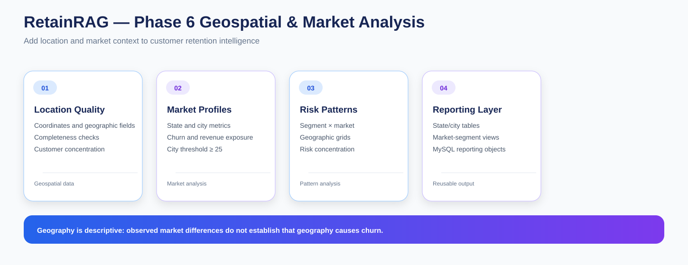

# RetainRAG — Phase 6: Geospatial & Market-Level Retention Analysis

Phase 6 adds geographic and market context to the RetainRAG customer-retention analysis.

I examine where customers are located, how churn and revenue exposure vary across locations, and how customer segments behave across markets. The objective is descriptive market intelligence, not causal geographic modeling.

---

## Objective

I use this phase to answer:

- Where are customers concentrated?
- How do retention metrics vary across states and cities?
- Which markets show higher historical revenue exposure?
- How do customer segments behave within markets?
- Where are geographic risk patterns concentrated?

---

## Notebook Sequence

### 01 — Geospatial Dataset & Location Quality

**01_geospatial_dataset_and_location_quality.ipynb**

I validate geographic fields before calculating location-level metrics.

Main checks include:

- location completeness
- state and city consistency
- latitude / longitude validity
- customer concentration
- geographic field quality

### 02 — Market-Level Retention & Revenue Analysis

**02_market_level_retention_and_revenue_analysis.ipynb**

I calculate retention and revenue metrics at:

- state level
- city level
- broader market level

I use customer counts alongside churn metrics so small markets are not interpreted without context.

### 03 — Geospatial Risk Patterns & Segment Geography

**03_geospatial_risk_patterns_and_segment_geography.ipynb**

I combine geographic and segment information.

Coverage includes:

- segment × market retention
- geographic risk concentration
- geographic grid analysis
- customer-segment distribution by market

### 04 — Geospatial Reporting & MySQL Publishing

**04_geospatial_reporting_and_mysql_publishing.ipynb**

I publish geographic outputs into MySQL tables and reusable reporting views.

---

## Market-Size Control

For city-level comparisons, I use a minimum city size of:

~~~
25 customers
~~~

This is a practical comparison rule used throughout the project so very small cities do not dominate interpretation because of a tiny denominator.

It is a reporting convention, not a statistical significance threshold.

---

## Analysis Coverage

The phase includes:

- customer-level location validation
- state and city customer concentration
- state retention profiles
- city retention profiles
- churn-rate comparisons
- historical revenue exposure
- segment × market analysis
- geographic-grid concentration
- MySQL reporting

---

## Geographic Grid

I also use a geographic grid representation based on rounded latitude and longitude values to examine local concentration patterns without claiming precise causal boundaries.

The grid is used as an analytical visualization and aggregation device.

---

## MySQL Outputs

### Tables

- state_retention_profile
- city_retention_profile
- market_segment_risk
- geographic_grid_profile

### Views

- vw_market_retention
- vw_market_segment_risk
- vw_geographic_risk_grid

---

## Notebook Presentation Standard

Every relevant analytical code cell is followed by a concise Result & conclusion section.

The analytical code also prints a short Result: line after the executed calculation or visualization.

Setup-only cells are not padded with artificial conclusions.

---

## Geographic Interpretation

The project treats geography as a descriptive dimension.

An observed difference between cities or states does not demonstrate that location causes churn.

Therefore I use language such as:

- higher observed churn
- greater historical revenue exposure
- concentrated customer population

rather than causal statements about geography.

---

## Role in RetainRAG

~~~
Phase 5
Customer segmentation
       +
Phase 6
Geographic and market context
       ↓
Phase 7
Retention strategy
       ↓
Phase 8
Benchmarking
       ↓
Phase 9
RAG knowledge layer
~~~

---

## Requirements

- pandas
- numpy
- matplotlib
- mysql-connector-python
- jupyter

---

## Key Outcome

Phase 6 turns retention analysis into market-aware retention intelligence.

The project can now describe:

- where customers are concentrated
- where churn differs
- where revenue exposure is concentrated
- how segments distribute across markets

while keeping geographic conclusions descriptive rather than causal.
