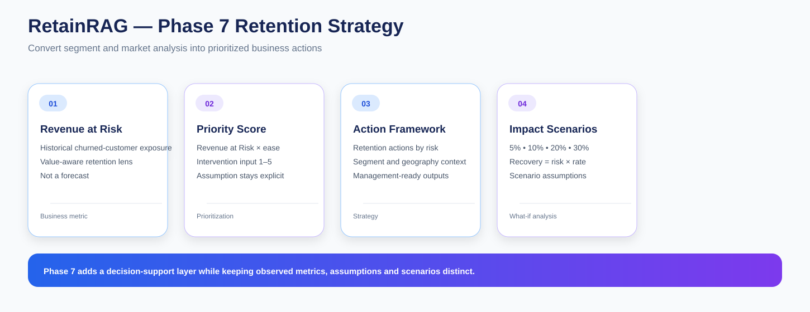

# RetainRAG — Phase 7: Retention Strategy & Business Intelligence Layer

Phase 7 turns the analytical findings from customer segmentation and market analysis into a business-facing retention strategy layer.

This is where RetainRAG moves from describing risk to structuring what should be prioritized, why it matters, and how scenario-based recovery could be evaluated.

---

## Objective

Phase 7 connects:

~~~
Phase 5 — Customer Segmentation & Retention Profiling
                       ↓
Phase 6 — Geospatial & Market-Level Retention Analysis
                       ↓
Phase 7 — Retention Strategy & Business Intelligence
~~~

The goal is to convert analytical outputs into decision-support artifacts that can be consumed by management-style reporting and the later RAG knowledge layer.

---

## Notebook Sequence

### 01 — Business Analysis Dataset & Intervention Input

**01_business_analysis_dataset_and_intervention_input.ipynb**

I bring together segment and market outputs and create the inputs required for business prioritization.

A key part of this notebook is the intervention-effort assumption.

### 02 — Revenue at Risk Prioritization

**02_revenue_at_risk_prioritization.ipynb**

I calculate and prioritize historical revenue exposure associated with customer churn.

### 03 — Retention Action Framework & Impact Scenarios

**03_retention_action_framework_and_impact_scenarios.ipynb**

I translate risk profiles into retention-action categories and create scenario-based recovery calculations.

### 04 — Executive Memo & MySQL Publishing

**04_executive_memo_and_mysql_publishing.ipynb**

I package the findings into:

- executive-style summary
- structured strategy outputs
- MySQL tables and reporting views

---

## Revenue at Risk

Revenue at Risk is treated as a historical exposure proxy.

It is based on revenue associated with customers already recorded as churned.

Therefore:

> Revenue at Risk is not a forecast of future lost revenue or future recovered revenue.

---

## Segment Priority

The project uses:

~~~
Priority Score
=
Revenue at Risk
×
Ease-of-Intervention Score
~~~

The ease-of-intervention score is a subjective 1–5 business input.

The project keeps this assumption visible because changing the intervention score changes the resulting priority structure.

---

## Geography Priority

I do not silently reuse segment intervention scores for state or city priorities.

Geography can receive its own optional input through:

**config/geography_ease_of_intervention_scores.csv**

When a geography-specific score is not provided, geographic analysis remains driven by the underlying Revenue at Risk information rather than an invented intervention assumption.

---

## Impact Scenarios

I estimate scenario recovery using:

~~~
Estimated Recovered Revenue
=
Revenue at Risk × Recovery Rate
~~~

Default scenario rates:

- 5%
- 10%
- 20%
- 30%

These are scenario assumptions, not forecasts.

---

## Retention Action Framework

The strategy layer connects analytical signals to potential intervention areas.

The framework can use:

- retention risk
- customer value
- segment profile
- geographic context
- intervention effort
- historical revenue exposure

---

## Main Outputs

### Strategy priorities

- segment_priority.csv
- state_priority.csv
- city_priority.csv
- retention_strategy_priority.csv

### Action framework

- retention_action_framework.csv

### Scenario analysis

- retention_impact_scenarios.csv
- retention_impact_scenario_summary.csv

### Management outputs

- phase_07_executive_memo.md
- phase_07_business_summary.json

---

## MySQL Outputs

- retention_strategy_priority
- retention_impact_scenarios
- retention_action_framework
- vw_retention_strategy_priority
- vw_retention_impact_scenarios
- vw_retention_action_framework

---

## Execution Order

~~~
Complete Phase 5 publishing
        ↓
Complete Phase 6 publishing
        ↓
Run Notebook 7.1
        ↓
Fill intervention assumptions
        ↓
Run Notebook 7.2
        ↓
Run Notebook 7.3
        ↓
Run Notebook 7.4
~~~

---

## Interpretation Rules

### Historical exposure is not a forecast

Revenue at Risk is based on observed churned customers.

### Priority is assumption-sensitive

The intervention score is subjective, so the priority structure changes when the score changes.

### Geographic analysis is descriptive

Market concentration does not prove geographic causation.

### Scenarios are scenarios

Recovery-rate calculations are arithmetic what-if cases, not expected outcomes.

---

## Role in RetainRAG

~~~
Data
 ↓
Analytics
 ↓
Customer segments
 ↓
Geographic context
 ↓
Revenue at Risk
 ↓
Priority logic
 ↓
Retention actions
 ↓
Scenario analysis
~~~

Phase 8 then adds benchmark context, while Phase 9 turns selected strategy and performance evidence into retrievable knowledge.

---

## Key Outcome

Phase 7 gives RetainRAG a way to move from:

> Here are the churn patterns

to:

> Here is the observed revenue exposure, the assumed intervention effort, the resulting priority structure, and the scenario-based recovery context.

That makes the analytical project much closer to a business decision-support system.
