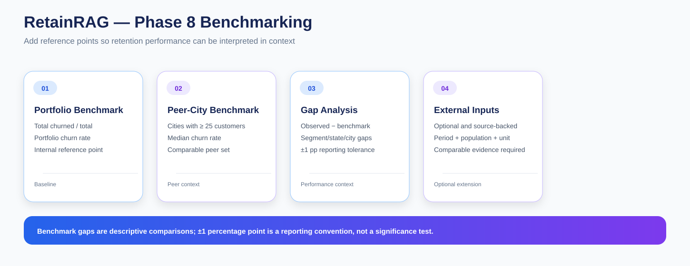

# RetainRAG — Phase 8: Benchmarking & Performance Context

Phase 8 adds benchmark context to the RetainRAG retention strategy layer.

After Phase 7 identifies retention priorities and revenue exposure, I use Phase 8 to compare observed churn patterns against explicit internal reference points and optional external benchmarks.

---

## Objective

Benchmarking answers a different question from churn analysis.

Instead of only asking:

> What is the observed churn rate?

I also ask:

> How does that observed value compare with a clearly defined reference point?

This helps provide context for segment, state and city performance.

---

## Notebook Sequence

### 01 — Benchmark Dataset & Benchmark Inputs

**01_benchmark_dataset_and_benchmark_inputs.ipynb**

I prepare the benchmark reference layer and define the internal benchmark rules.

### 02 — Churn & Revenue Benchmarking

**02_churn_and_revenue_benchmarking.ipynb**

I calculate observed-versus-reference comparisons across relevant dimensions.

### 03 — Benchmark Gap Analysis & Management Views

**03_benchmark_gap_analysis_and_management_views.ipynb**

I translate the differences into benchmark gaps and management-oriented summaries.

### 04 — Benchmark Reporting & MySQL Publishing

**04_benchmark_reporting_and_mysql_publishing.ipynb**

I publish benchmark results into MySQL tables and reusable views.

---

## Core Benchmark Logic

### Portfolio churn benchmark

~~~
Total churned customers
-----------------------
Total customers
× 100
~~~

### Peer-city benchmark

For city-level comparison I use:

> Median churn rate among cities with at least 25 customers.

### Benchmark gap

~~~
Benchmark Gap
=
Observed Churn Rate
−
Benchmark Churn Rate
~~~

---

## Status Convention

The default reporting tolerance is:

~~~
±1.0 percentage point
~~~

This can be used to categorize the size of the observed gap for management reporting.

Important:

> The ±1 percentage-point tolerance is a reporting convention, not a statistical significance test.

---

## External Benchmarks

External benchmarks are optional.

The file **config/external_benchmark_inputs.csv** is used only when I have evidence that is directly comparable.

A usable external benchmark should retain:

- source
- time period
- population
- unit
- notes
- comparability context

If no directly comparable external benchmark is available, the phase remains complete using internal benchmarks alone.

---

## Main Outputs

~~~
benchmark_reference.csv
segment_benchmark_gap.csv
state_benchmark_gap.csv
city_benchmark_gap.csv
segment_benchmark_status_summary.csv
city_benchmark_management_view.csv
segment_strategy_benchmark_view.csv
external_benchmark_gap.csv
benchmark_gap_summary.csv
~~~

---

## MySQL Outputs

- benchmark_reference
- segment_benchmark_gap
- state_benchmark_gap
- city_benchmark_gap
- benchmark_gap_summary
- city_benchmark_management_view
- segment_strategy_benchmark_view
- external_benchmark_gap

Matching vw_* reporting views are also created for reusable access.

---

## Management Views

The benchmark layer helps organize questions such as:

- Which segments have churn above the internal reference?
- Which cities sit above or below the peer benchmark?
- How large is the benchmark gap?
- Which strategy priorities are associated with different benchmark contexts?

---

## Interpretation Rules

Benchmarking remains descriptive.

A benchmark gap:

- does not prove causation
- does not automatically imply a specific intervention
- does not constitute a forecast
- depends on the benchmark definition and comparison population

Revenue at Risk also retains its Phase 7 interpretation as a historical exposure proxy.

---

## Execution Order

~~~
Complete Phase 7.1–7.4
        ↓
Run Notebook 8.1
        ↓
Review internal benchmark definitions
        ↓
Optionally add comparable external benchmark inputs
        ↓
Run Notebook 8.2
        ↓
Run Notebook 8.3
        ↓
Run Notebook 8.4
~~~

---

## Role in RetainRAG

~~~
Phase 7
Retention strategy
      ↓
Phase 8
Benchmark context
      ↓
Phase 9
Knowledge corpus
      ↓
Phase 10
AI business assistant
~~~

---

## Key Outcome

Phase 8 adds a reference frame to the retention analysis.

Instead of presenting churn and priority metrics in isolation, RetainRAG can now provide:

- observed performance
- benchmark value
- benchmark gap
- management-oriented context

while keeping the comparison methodology explicit.
