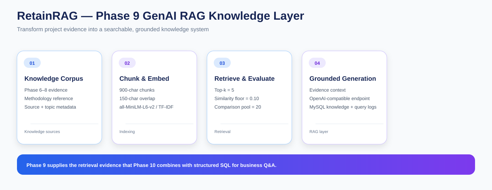

# RetainRAG — Phase 9: GenAI / RAG Knowledge Layer

Phase 9 turns the analytical outputs from Phases 6–8 into a searchable **Retrieval-Augmented Generation (RAG) knowledge layer**.

This is the point where the project begins connecting traditional analytics with Generative AI. The goal is not to replace the underlying analysis with an LLM. Instead, I create a retrieval system that can supply project-specific evidence and context to the later AI assistant.

---

## Objective

I want the project to answer natural-language questions using its own analytical evidence.

The core design is:

~~~
Business question
      ↓
Retrieve relevant project evidence
      ↓
Build grounded context
      ↓
Optional LLM generation
      ↓
Evidence-aware answer
~~~

This keeps the knowledge layer tied to RetainRAG instead of relying only on general model knowledge.

---

## Notebook Sequence

### 01 — Knowledge Source Inventory & Corpus

**01_knowledge_source_inventory_and_corpus.ipynb**

I collect project evidence primarily from Phase 6–8 reporting views and add a curated project-methodology reference.

Each knowledge record keeps metadata such as:

- source name
- topic
- document identity
- project context

Main outputs:

- knowledge_documents.csv
- knowledge_source_inventory.csv

### 02 — Chunking & Embedding Index

**02_chunking_and_embedding_index.ipynb**

I transform the knowledge corpus into retrieval-ready chunks.

Current configuration:

| Parameter | Value |
|---|---:|
| Chunk size | 900 characters |
| Chunk overlap | 150 characters |
| Top-k | 5 |
| Similarity floor | 0.10 |
| Comparison candidate pool | 20 |

The semantic embedding model is **all-MiniLM-L6-v2** when SentenceTransformers is available.

A TF-IDF artifact can be used as a fallback when semantic embedding infrastructure is unavailable.

### 03 — Retrieval Evaluation & Grounded Context

**03_retrieval_evaluation_and_grounded_context.ipynb**

I test representative RetainRAG questions against the actual saved retrieval index.

The notebook evaluates:

- retrieved evidence
- similarity behavior
- comparison-oriented retrieval
- grounded context construction

Main outputs include:

- retrieval_evaluation.csv
- sample_retrieval_results.csv
- grounded_context_example.md

### 04 — RAG Answer Generation & MySQL Publishing

**04_rag_answer_generation_and_mysql_publishing.ipynb**

I connect the retrieval layer to an optional OpenAI-compatible generation endpoint.

The generation layer is instructed to:

- stay within supplied evidence
- cite evidence identifiers
- distinguish observed metrics from assumptions
- avoid unsupported numbers

When generation is disabled or unavailable, the notebook can return retrieval-only evidence rather than pretending that a model-generated answer was produced.

---

## Core RAG Architecture

~~~
Project analytical outputs
        ↓
Knowledge documents
        ↓
Overlapping chunks
        ↓
Embeddings / retrieval vectors
        ↓
Semantic similarity
        ↓
Top-k evidence
        ↓
Grounded context
        ↓
Optional LLM generation
~~~

---

## Knowledge Sources

The knowledge layer is built around project evidence rather than arbitrary internet content.

Primary analytical knowledge comes from:

- Phase 6 geospatial and market analysis
- Phase 7 retention strategy and Revenue at Risk
- Phase 8 benchmark context

A curated methodology reference can also be included so the assistant can explain project terminology and analytical rules.

---

## Retrieval Artifacts

~~~
knowledge_documents.csv
knowledge_source_inventory.csv
retrieval_chunks.csv
retrieval_vectors.npy
retrieval_manifest.json
retrieval_evaluation.csv
sample_retrieval_results.csv
grounded_context_example.md
rag_demo_answers.csv
tfidf_vectorizer.joblib
~~~

The TF-IDF vectorizer is produced when the fallback retrieval backend is used.

---

## Chunking Strategy

I use overlapping character-based chunks so useful context is preserved across chunk boundaries.

Current configuration:

~~~
chunk_size    = 900
chunk_overlap = 150
~~~

The overlap is intended to reduce the chance that an important statement is split across unrelated chunks.

---

## Retrieval Strategy

A standard question uses:

~~~
top_k = 5
~~~

Comparison questions can use a broader candidate pool:

~~~
comparison_candidate_k = 20
~~~

This is useful for questions containing terms such as highest, lowest, top, bottom, compare, versus and difference.

The broader pool is intended to improve the chance that retrieved evidence contains the comparable records needed for the question.

---

## Similarity Threshold

The current retrieval threshold is:

~~~
similarity_floor = 0.10
~~~

This acts as a minimum semantic-similarity requirement before weak matches are included in the final evidence set.

---

## Retrieval Backend

### Preferred

SentenceTransformers using **all-MiniLM-L6-v2**.

### Fallback

TF-IDF using a saved vectorizer artifact when semantic embeddings are unavailable.

---

## Grounded Context

Retrieved chunks are converted into a context block that carries:

- evidence identifiers
- source names
- topics
- similarity scores
- chunk text

Conceptually:

~~~
Question
+
Retrieved evidence
+
Source metadata
=
Grounded context
~~~

The generation layer receives this context rather than being asked to answer solely from pretrained knowledge.

---

## LLM Configuration

The current Phase 9 configuration is prepared for a local OpenAI-compatible endpoint:

~~~
llm_enabled   = true
llm_base_url  = http://localhost:11434/v1
llm_model     = qwen3:4b
~~~

This matches the local Ollama + Qwen3 4B setup used by Phase 10.

---

## MySQL Outputs

The knowledge layer publishes:

- rag_knowledge_documents
- rag_query_log
- vw_rag_knowledge_catalog
- vw_rag_query_log

This makes the knowledge catalog and query activity available from the same MySQL environment as the earlier analytical layers.

---

## Important Interpretation Rules

### Revenue at Risk

Historical exposure proxy, not a forecast.

### Priority scores

Depend on explicit intervention assumptions.

### Benchmark gaps

Descriptive comparisons, not causal or predictive conclusions.

### Geography

Descriptive context that does not establish that location causes churn.

### External benchmarks

Require explicit comparable source metadata.

### Insufficient evidence

The assistant should say when the retrieved evidence is not sufficient to support an answer.

---

## Role in RetainRAG

~~~
Phases 1–8
Analytical evidence
      ↓
Phase 9
Knowledge corpus + embeddings + retrieval
      ↓
Phase 10
Hybrid SQL + RAG assistant
~~~

The important idea is that RAG is connected directly to the previous analytics rather than creating a disconnected chatbot dataset.

---

## Requirements

- pandas
- numpy
- scikit-learn
- sentence-transformers
- joblib
- requests
- mysql-connector-python
- jupyter

---

## Key Outcome

Phase 9 turns RetainRAG's analytical outputs into a retrievable knowledge system.

The project now has:

- a project-specific corpus
- source metadata
- chunked knowledge
- retrieval vectors
- similarity-based retrieval
- retrieval evaluation
- grounded context
- optional LLM generation
- MySQL knowledge publishing

This becomes the foundation for the interactive AI assistant completed in Phase 10.
