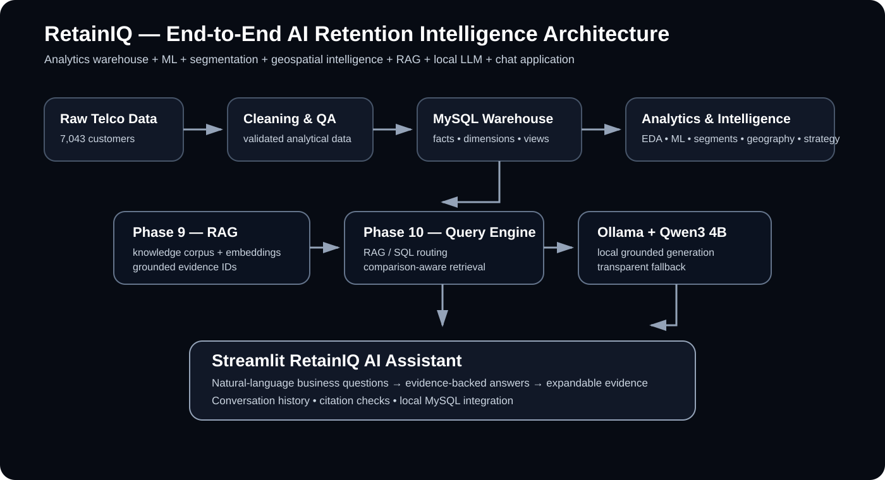
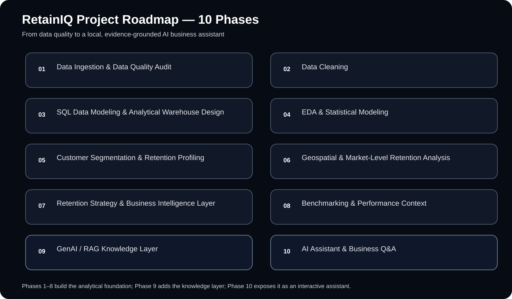

# RetainIQ — AI-Powered Telecom Customer Retention Intelligence Platform

<p align="center">
  <strong>From raw telecom data to an evidence-grounded AI retention assistant.</strong><br/>
  A 10-phase portfolio project combining data analytics, MySQL, machine learning, customer segmentation, geospatial analysis, business intelligence, RAG, and a local LLM application.
</p>

<p align="center">
  
  
  
  
</p>

## Overview

RetainIQ is an end-to-end telecom customer-retention intelligence platform built around a single goal: turn customer-level telecom data into reproducible business insights and then expose those insights through a natural-language AI assistant.

The project starts with data quality and analytical modeling, builds a reusable MySQL warehouse, adds statistical and machine-learning analysis, discovers customer segments, evaluates geographic retention patterns, converts those findings into retention strategy and benchmark context, and finally turns the resulting evidence into a RAG-powered knowledge layer and local AI assistant.

The final application uses a **hybrid architecture**:

- **RAG** for methodology, definitions, business context, strategy, geography, and benchmark evidence.
- **MySQL** for exact structured metrics and comparison queries.
- **Ollama + Qwen3 4B** for local answer generation.
- **Evidence IDs / source metadata** so answers remain traceable.
- **Streamlit** for the interactive chat experience.

> **Project principle:** observed metrics, calculations, scenario assumptions, and limitations are kept distinct. When the available evidence is insufficient, the assistant is expected to say so rather than inventing figures.

## Architecture



### End-to-end flow

```text
Raw telecom data
      ↓
Data quality audit + cleaning
      ↓
MySQL analytical warehouse
      ↓
EDA + statistics + churn modeling
      ↓
Customer segmentation
      ↓
Geospatial + market retention analysis
      ↓
Retention strategy + BI
      ↓
Benchmarking
      ↓
RAG knowledge layer
      ↓
Hybrid SQL/RAG query engine
      ↓
Ollama + Qwen3 4B
      ↓
Streamlit AI Assistant
```

## Project roadmap



| Phase | Focus | Main outcome |
|---|---|---|
| 1 | Data Ingestion & Data Quality Audit | Profiling, integrity checks, business-field audit |
| 2 | Data Cleaning | Standardized analytical dataset |
| 3 | SQL Data Modeling & Warehouse Design | MySQL fact/dimension model and reporting views |
| 4 | EDA & Statistical Modeling | Churn drivers, statistical tests, baseline ML |
| 5 | Customer Segmentation | K-Means segments and retention profiles |
| 6 | Geospatial & Market Retention | State/city risk profiles and segment geography |
| 7 | Retention Strategy & BI | Priority scoring, action framework, impact scenarios |
| 8 | Benchmarking | Internal benchmarks and benchmark-gap context |
| 9 | GenAI / RAG Knowledge Layer | Searchable, evidence-linked project knowledge |
| 10 | AI Assistant & Business Q&A | Hybrid RAG + SQL local chatbot |

## Dataset

The project uses a telecom customer dataset with:

- **7,043 customer records**
- **50 source columns**
- **One customer per analytical record after cleaning**
- Historical customer-status categories including **Churned, Stayed, and Joined**

The Phase 1 audit recorded:

- 1,869 churned customers
- 5,174 stayed customers
- 454 joined customers
- 0 duplicate Customer IDs
- 0 missing Customer IDs
- 0 negative audited financial values

The cleaned analytical dataset adds an `is_new_customer` flag while preserving the original source file.

## What I built

### Data foundation — Phases 1–3

I first established the analytical grain and documented data-quality decisions before modifying the data.

Phase 2 standardizes categorical/text fields and adds the new-customer flag.

Phase 3 moves the cleaned data into **MySQL 8.x** using a reusable analytical warehouse design with staging, fact, dimension, keys, indexes, views, validation queries, CTEs, aggregations, CASE expressions, and window functions.

The core customer-level model provides reusable business views such as Customer 360, retention summaries, contract performance, and revenue-at-risk exposure.

### Analytics & ML — Phases 4–5

Phase 4 uses MySQL-backed analytical datasets for:

- exploratory data analysis
- Welch independent-samples t-tests
- chi-square tests of independence
- correlation analysis
- Logistic Regression
- Random Forest
- stratified train/test evaluation
- 5-fold stratified cross-validation
- ROC AUC, precision, recall, F1, average precision
- confusion matrices
- feature importance and coefficient interpretation
- churn probability bands

Historical churn modeling uses **Stayed + Churned** customers. Joined customers are kept outside the historical churn-training population.

Phase 5 discovers behavior/value/service/account segments using **K-Means** with one-hot encoding, standardization, inertia, silhouette analysis, cluster-size checks, stability testing, and PCA visualization.

Churn outcome fields are not used to create the clusters; they are brought back afterward for retention profiling.

### Geography & business intelligence — Phases 6–8

Phase 6 validates geographic data and creates market-level retention profiles for states and cities, including churn rate, customer count, CLTV, revenue exposure, satisfaction, and market-size-aware comparisons.

Geography is treated as **descriptive**. A geographic pattern does not by itself establish causation.

Phase 7 translates analytical findings into a business layer:

`Priority Score = Revenue at Risk × Ease-of-Intervention Score`

The ease-of-intervention score is a subjective business input on a 1–5 scale.

Impact scenarios use:

`Estimated Recovered Revenue = Revenue at Risk × Recovery Rate`

with default scenario assumptions of 5%, 10%, 20%, and 30%. These are **scenario assumptions, not forecasts**.

Phase 8 adds internal benchmark context, including:

`Benchmark Gap = Observed Churn Rate − Benchmark Churn Rate`

The default reporting tolerance is ±1.0 percentage point. This is a reporting convention, not a statistical significance test.

### GenAI / RAG — Phases 9–10

Phase 9 turns selected Phase 6–8 outputs and project methodology into a searchable knowledge corpus.

The RAG layer stores:

- knowledge documents
- source metadata
- chunk IDs
- semantic embeddings
- retrieval diagnostics
- grounded context examples
- answer-generation demos

Phase 10 converts that foundation into a reusable application backend and a browser-based assistant.

The query engine can:

1. detect question type
2. retrieve relevant evidence
3. route exact metric/comparison questions to MySQL when supported
4. build grounded context
5. call a local OpenAI-compatible LLM endpoint
6. return an evidence-cited answer
7. expose evidence metadata in the Streamlit UI
8. validate citation identity and prepare conversation logs

## Final application

The final app lives in:

`Phase 10 — AI Assistant & Business Q&A/app/`

- `query_engine.py` — reusable hybrid RAG + SQL backend
- `streamlit_app.py` — Streamlit chat interface

Launch from the Phase 10 project root:

```bash
streamlit run app/streamlit_app.py
```

The local LLM is configured around **Ollama + Qwen3 4B**.

Expected local endpoint:

`http://localhost:11434/v1`

The application is designed to show the evidence used for each answer.

## Example questions

The final assistant can be tested with questions such as:

- What is the overall churn rate in RetainIQ?
- What is revenue at risk and how is it calculated?
- Which customer segment has the highest revenue at risk?
- Compare the customer segments by churn rate and revenue at risk.
- Which city has the highest revenue at risk?
- How does a city's churn rate compare with its peer-city benchmark?
- What does a 20% recovery scenario mean?
- What is the benchmark gap?
- What assumptions are used in the retention impact scenarios?
- Does geography cause customer churn in RetainIQ?

The last type of question is deliberately important because the project treats geography as a descriptive dimension rather than a causal explanation.

## Repository structure

```text
RetainIQ-Telecom-Customer-Retention-Intelligence/
│
├── Phase 1 — Data Ingestion & Data Quality Audit/
├── Phase 2 — Data Cleaning/
├── Phase 3 — SQL Data Modeling & Analytical Warehouse Design/
├── Phase 4 — EDA & Statistical Modeling/
├── Phase 5 — Customer Segmentation & Retention Profiling/
├── Phase 6 — Geospatial & Market-Level Retention Analysis/
├── Phase 7 — Retention Strategy & Business Intelligence Layer/
├── Phase 8 — Benchmarking & Performance Context/
├── Phase 9 — GenAI  RAG Knowledge Layer/
├── Phase 10 — AI Assistant & Business Q&A/
│   ├── app/
│   ├── config/
│   ├── docs/
│   ├── notebooks/
│   ├── outputs/
│   ├── sql/
│   ├── README.md
│   └── requirements.txt
│
├── docs/
│   └── images/
│       ├── retainiq-architecture.svg
│       └── retainiq-roadmap.svg
│
└── telco.csv
```

## Notebook design standard

The notebooks are intentionally split by responsibility rather than built as one oversized notebook.

For the analytical notebooks, relevant code cells are followed by concise **Result & conclusion** cells. Setup/import cells are kept lean so the notebooks remain readable without artificial commentary.

The narrative is written in first person so the work reads like a reproducible portfolio project.

## Reproducibility notes

### MySQL

Phase 3 onward uses MySQL locally. The project code is designed around:

- host: `localhost`
- port: `3306`
- dedicated project database: `retainiq`

Credentials should be supplied locally and **must not be committed to GitHub**.

### LLM

The application expects Ollama to be running locally with the configured model available:

```bash
ollama list
```

Then start the Streamlit application:

```bash
streamlit run app/streamlit_app.py
```

### Phase dependencies

Phase 10 depends on Phase 9 retrieval artifacts. The backend resolves the Phase 9 sibling folder and checks for:

- `outputs/retrieval_chunks.csv`
- `outputs/retrieval_vectors.npy`
- `outputs/retrieval_manifest.json`

## Important interpretation rules

### Revenue at risk

Revenue at risk is a **historical exposure proxy**: the sum of `total_revenue` associated with customers already recorded as churned. It is not a forecast of future lost revenue.

### Priority score

The priority score combines revenue exposure with an explicit 1–5 business input for ease of intervention. Changing that assumption can change the resulting priority.

### Recovery scenarios

Recovery rates are scenario inputs. A 20% scenario is not a prediction that 20% of at-risk revenue will actually be recovered.

### Benchmarks

Benchmark gaps are descriptive comparisons against explicit reference points. They do not establish causation and are not forecasts.

### Geography

Geographic analysis describes patterns across markets. It does not prove that geography causes churn.

### RAG grounding

The AI assistant should stay within the evidence supplied to it. When the evidence does not support a claim, the correct behavior is to state that the evidence is insufficient.

## Known limitation / next engineering improvement

The current Phase 10 backend has a deliberately conservative routing layer. Exact SQL routes cover the most important supported metrics/comparisons, while unsupported phrasings can fall back to RAG.

A natural next improvement would be a more general intent/entity/metric parser so phrases such as `rank the segments`, `top 5 segments`, `compare CLTV across segments`, and similar variants can be mapped to structured SQL automatically instead of depending on narrow keyword patterns.

This limitation is visible in the evaluation notebooks and is intentionally kept transparent rather than hidden.

## Tech stack

**Languages:** Python, SQL, Markdown  
**Database:** MySQL 8.x  
**Analytics:** pandas, NumPy, matplotlib, scikit-learn  
**Statistics:** SciPy  
**ML:** Logistic Regression, Random Forest, K-Means  
**RAG:** SentenceTransformers, TF-IDF fallback, saved vector index  
**LLM:** Ollama, Qwen3 4B  
**Application:** Streamlit  
**Environment:** Jupyter Notebook / VS Code

## Why RetainIQ

I built RetainIQ as a complete analytics-to-application workflow rather than a standalone dashboard or a single ML model.

The final project connects:

`data quality → data warehouse → analytics → ML → segmentation → geography → strategy → benchmarking → RAG → LLM → application`

That makes the repository both a technical implementation and a documented example of how analytical work can be turned into an evidence-grounded business application.

## License / usage

This repository is intended as a portfolio and educational project. Please review the original dataset's licensing/usage terms separately before redistributing the raw source data.
